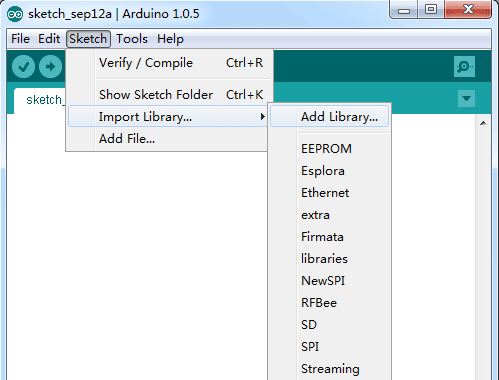

# 2digital 7segment control with 74hc595n 

here is a library that allows you to control 1 digital or 2digital 7segment with a 74hc595
you need to download [.zip file](https://github.com/BLOCTECHNO/Digital_7segment_control/archive/master.zip) library and add on arduino

----
### schema

		default connection

	(74hc595n) latchPin -> 4 (arduino)
   	(74hc595n) clockPin -> 3 (arduino)
   	(74hc595n) dataPin  -> 2 (arduino)
   	(74hc595n) segment1 -> 6 (arduino)
   	(74hc595n) segment2 -> 5 (arduino)

#### Examples
2digital_7segment send value on serial monitor

analog_print_value

----
### for using

	#include  "segment.h"

	//déclare new instance
	Segment m;

	void setup()
	{
		m.Initial();
		.....
		.....  //YOUR INSTRUCTION
		.....

	}

	void loop()
	{
		m.clear_All();
		.....
		.....
		.....	//YOUR INSTRUCTION
		.....
		m.scree(parametre);
	}

 #include "segment.h" => it's important

   Segment m; => for declare new instance

   m.Initial (); => m.Initial syntax ((latchPin, dataPin, clockPin, segment1, segment2);
    If you do not give a parameter, it will use the default connection, or if you want to choose your own pin number as a parameter.
   Example: initial m (7,8,9,10,11);

   m.clear_All (); => to disable all segments

   m.screen (parameter); => function to display the parameter you gave, it is only partisan integer (int) if you have another variable convert it to int

	 on parameter give "1" to turn on point segment of first digital segment
	 on parameter give "2" to turn on point segment of second digital segment

  you can look at examples sketch on your files library

----
### in a future release
* to able to use 3 and 4 digit 7 segment
* new function to easily using the 7 segment
* try to create this library for  micropython

----
### Contribute
we invite all people to contribute and improve this library

[Email](contact@bloctechno.ovh)
[facebook](https://facebook.com/bloctechno)
[instagram](https://instagram.com/bloctechno)
[youtube](https://www.youtube.com/user/ThePipa00/videos)

by bloc techno
